# AC-Gen 项目架构规划

> AC-Gen：空调产品图批量合成生成器
> 类似 Photoshop 图层合成 + Figma 模型实例化批量导出

---

## 一、项目概述

### 1.1 核心目标

基于上传的 PNG 资产（产品图 + 装饰图），通过**元数据标签匹配**规则，自动组合图层并**批量生成**最终合成图。

### 1.2 核心流程

```
┌──────────┐   ┌──────────┐   ┌──────────┐   ┌───────────────┐   ┌───────────────┐   ┌──────────┐
│产品图上传│   │装饰图上传│   │组合配置  │   │ 项目级预览    │   │ 实例微调      │   │批量导出  │
│(公用资产)│──▶│(项目专用)│──▶│(标签匹配)│──▶│ (图层排序)    │──▶│ (位置/价格)   │──▶│(PNG文件) │
└──────────┘   └──────────┘   └──────────┘   └───────────────┘   └───────────────┘   └──────────┘
```

**流程说明：**

1. **产品图上传**：上传产品主图（PNG），设置元数据（系列、颜色、能效、匹数）
2. **装饰图上传**：上传项目专属装饰图（角标、Logo等），绑定项目名称
3. **组合配置**：选择产品 + 项目，系统自动生成变体实例列表
4. **项目级预览**：Canvas 预览，拖拽调整图层上下层关系，保存为项目模板
5. **实例微调**：选择具体实例（如 `天丽-皓雪白-挂机-26`），调整价格文本、装饰图XY位置
6. **批量导出**：根据所有实例配置，批量渲染并打包下载

### 1.3 关键约束

| 项目 | 规格 |
|------|------|
| 画布尺寸 | 固定 800×800 像素 |
| 资产格式 | PNG（带透明通道） |
| 产品图 | **公用资产库**，可跨项目复用 |
| 装饰图 | **项目专属**，必须绑定 `projectName` |

---

## 二、系统模块设计

```
AC-Gen
├── 📁 组件01: 资产管理 (Asset Library)
│   ├── ProductAsset CRUD（产品图管理）
│   └── DecorationAsset CRUD（装饰图管理）
│
├── 📁 组件02: 项目管理 (Project Manager)
│   ├── 项目创建/编辑/删除
│   └── 项目关联的装饰图列表
│
├── 📁 组件03: 组合配置器 (Composition Builder)
│   ├── 选择项目
│   ├── 勾选产品图（从公用库）
│   ├── 配置机型变量（能效 × 匹数）
│   └── 生成实例列表（变体展开）
│
├── 📁 组件04: 项目模板编辑器 (Project Template Editor) 🆕
│   ├── Canvas 预览（基于项目默认配置）
│   ├── 图层面板（拖拽排序）
│   ├── 保存项目级图层顺序
│   └── 显示缺失数据提示
│
├── 📁 组件05: 实例微调器 (Instance Fine-Tuner) 🆕
│   ├── 选择具体实例（如：天丽-挂机-B3-皓雪白-26）
│   ├── 价格文本编辑（原价/活动价）
│   ├── 装饰图位置调整（XY轴拖拽）
│   └── 保存实例专属配置
│
├── 📁 组件06: 图层合成引擎 (Layer Compositor)
│   ├── 标签匹配逻辑
│   ├── Canvas 图层叠加渲染
│   └── PNG 导出
│
└── 📁 组件07: 批量生成器 (Batch Generator)
    ├── 读取所有实例配置
    ├── 渲染队列管理
    └── ZIP 打包下载
```

---

## 三、数据模型总览

### 3.1 关系图

```
┌─────────────────────────────────────────────────────────────┐
│                        Project                               │
│  projectName: "haier_2025_q1"                               │
│  canvasWidth: 800                                           │
│  canvasHeight: 800                                          │
├─────────────────────────────────────────────────────────────┤
│                                                              │
│  ┌──────────────┐ 1:N  ┌──────────────────────────────────┐ │
│  │ ProductAsset │ ◀──▶ │ DecorationAsset                   │ │
│  │ (公用资产库)  │      │ (项目专属)                        │ │
│  │              │      │ projectName: "haier_2025_q1"      │ │
│  │ energyLevels │      │ energyLevels?: [B1, B3]           │ │
│  │ capacityCodes│      │ capacityCodes?: [26, 35]          │ │
│  └──────────────┘      └──────────────────────────────────┘ │
│         │                        │                          │
│         │                        │                          │
│         ▼                        ▼                          │
│  ┌────────────────────────────────────────────────────────┐ │
│  │               CompositionInput                         │ │
│  │   projectName + productId + energyLevel + capacityCode │ │
│  └────────────────────────────────────────────────────────┘ │
│                          │                                  │
│                          ▼                                  │
│  ┌────────────────────────────────────────────────────────┐ │
│  │               Layer Compositor                         │ │
│  │   匹配装饰图 → 叠加图层 → 输出 PNG                      │ │
│  └────────────────────────────────────────────────────────┘ │
└─────────────────────────────────────────────────────────────┘
```

### 3.2 核心数据类型

```ts
// ========== 基础类型 ==========
type EnergyLevelCode = 'B1' | 'B3';
type CapacityCode = '26' | '35' | '50' | '72' | '100';

// ========== 产品图（公用资产） ==========
type ProductCategory = 'AC' | 'LIFE_APPLIANCE'; // 空调 | 生活电器
type AcFormFactor = 'WALL' | 'CABINET';         // 挂机 | 柜机

type ProductAssetMeta = {
  category: ProductCategory;
  
  // 仅当 category === 'AC' 时必填
  acFormFactor?: AcFormFactor;

  series: string;          // 例如：天丽
  color: string;           // 例如：皓雪白 (原 colorTheme 拆分为 series + color)

  // 适用范围匹配规则：
  // 1. 空调 (AC)：energyLevels 和 capacityCodes 通常必填
  // 2. 生活电器 (LIFE_APPLIANCE)：这两个字段通常为空 (null/undefined)
  energyLevels?: EnergyLevelCode[];
  capacityCodes?: CapacityCode[];
};

type ProductAsset = {
  id: string;
  filePath: string;        // products/天丽_白.png
  meta: ProductAssetMeta;
};

// ========== 装饰图（项目专属） ==========
type DecorationAssetMeta = {
  projectName: string;     // 必填，绑定项目
  category: DecorationCategory;
  energyLevels?: EnergyLevelCode[];
  capacityCodes?: CapacityCode[];
  zIndex?: number;         // 图层顺序
};

type DecorationCategory = 
  | 'BACKGROUND'      // 背景底图
  | 'ENERGY_BADGE'    // 能效角标
  | 'CAPACITY_BADGE'  // 匹数角标
  | 'BRAND_LOGO'      // 品牌Logo
  | 'OTHER';          // 其他装饰 (PNG)

// ========== 价格样式配置 (项目级/模板级) ==========
// 价格不是 PNG 图片，而是渲染的文本图层
type PriceLayerConfig = {
  x: number;
  y: number;
  fontFamily: string;
  fontSize: number;
  color: string;
  projectId: string; // 关联项目
};

type DecorationAsset = {
  id: string;
  filePath: string;
  meta: DecorationAssetMeta;
};

// ========== 项目 ==========
type Project = {
  id: string;
  projectName: string;     // 格力_2025_q1
  displayName: string;     // 格力2025年Q1活动
  canvasWidth: 800;
  canvasHeight: 800;
  createdAt: string;
  
  // ========== 🆕 项目模板配置 ==========
  template?: ProjectTemplate;
};

type ProjectTemplate = {
  // 项目级默认图层顺序（用户在"项目级预览"中拖拽调整保存）
  layerOrder: LayerOrderConfig[];
  
  // 项目级默认价格配置（可被实例覆盖）
  defaultPriceConfig?: {
    originalPrice: PriceLayerConfig;
    promoPrice: PriceLayerConfig;
  };
};

type LayerOrderConfig = {
  type: 'background' | 'product' | 'decoration' | 'price';
  // 如果是 decoration，需指定具体是哪个装饰图类别
  decorationCategory?: DecorationCategory;
  zIndex: number;
};

// ========== 🆕 实例配置（实例微调） ==========
type InstanceConfig = {
  id: string;
  projectId: string;
  
  // 实例标识（唯一组合）
  productId: string;
  energyLevel?: EnergyLevelCode;
  capacityCode?: CapacityCode;
  
  // ========== 实例专属调整 ==========
  // 价格文本覆盖
  priceOverride?: {
    original: string;
    promo: string;
    // 可选：调整价格文本位置（覆盖项目默认）
    originalPosition?: { x: number; y: number };
    promoPosition?: { x: number; y: number };
  };
  
  // 装饰图位置微调（相对于项目默认）
  decorationAdjustments?: DecorationAdjustment[];
  
  createdAt: string;
  updatedAt: string;
};

type DecorationAdjustment = {
  decorationId: string;
  // 相对于原始位置的偏移量
  offsetX: number;
  offsetY: number;
};

// ========== 组合输入 ==========
type CompositionInput = {
  projectName: string;
  productId: string;
  energyLevel?: EnergyLevelCode;
  capacityCode?: CapacityCode;
  // 可选：动态文本
  priceOriginalText?: string;
  pricePromoText?: string;
};

// ========== 渲染输出 ==========
type CompositionOutput = {
  // 命名规范：<系列>-<形态>-<能效>-<色彩>-<匹数>.png
  // 例：冷静尊-柜机-B1-奢华金-72.png
  // 例：天丽-壁挂-B3-皓雪白-26.png
  fileName: string;
  layers: LayerItem[];
  blob: Blob;
};

type LayerItem = {
  id: string;
  type: 'image' | 'text';
  // image 属性
  assetId?: string;
  filePath?: string;
  // text 属性
  textContent?: string;
  textStyle?: PriceLayerConfig;
  
  zIndex: number;
};
```

---

## 四、图层合成逻辑

### 4.1 图层匹配规则

```ts
function matchDecorations(
  decorations: DecorationAsset[],
  input: CompositionInput
): DecorationAsset[] {
  return decorations.filter(deco => {
    const { projectName, energyLevels, capacityCodes } = deco.meta;
    
    // 1. 必须属于当前项目
    if (projectName !== input.projectName) return false;
    
    // 2. 如果装饰图定义了 energyLevels，检查是否匹配
    if (energyLevels?.length && input.energyLevel) {
      if (!energyLevels.includes(input.energyLevel)) return false;
    }
    
    // 3. 如果装饰图定义了 capacityCodes，检查是否匹配
    if (capacityCodes?.length && input.capacityCode) {
      if (!capacityCodes.includes(input.capacityCode)) return false;
    }
    
    return true;
  });
}
```

### 4.2 图层叠加顺序管理

> **核心原则**：Z-Index 不写死，支持 UI 拖拽排序。

系统应维护一个 **有序图层列表** (Layer List)，渲染时直接按照列表顺序绘制：

1. **默认层级**（初始载入时建议顺序）：
   - Bottom: 背景图
   - Middle: 产品图
   - Top: 装饰图 / 价格文本

2. **用户调整**：
   - 提供类似 PS 的图层面板
   - 支持**鼠标拖拽**调整图层上下顺序 (Drag & Drop Sorting)
   - 调整结果保存到 `Template` 或 `Project` 配置中
```

### 4.3 批量生成示例

```
输入:
  项目: 格力_2025_q1
  产品图: 天丽_皓雪白.png 
     (meta: series="天丽", formFactor="挂机", color="皓雪白", energyLevels=["B3"], capacityCodes=["26", "35"])
  
自动展开:
  CompositionInput[0]: { ..., energyLevel: "B3", capacityCode: "26" }
  CompositionInput[1]: { ..., energyLevel: "B3", capacityCode: "35" }

输出:
  天丽-挂机-B3-皓雪白-26.png
  天丽-挂机-B3-皓雪白-35.png
```

---

## 五、技术栈推荐

### 5.1 总体架构

```
┌─────────────────────────────────────────────────────────────┐
│                        Frontend                              │
│   React 18 + Vite + TypeScript                              │
│   UI: Ant Design 5.x                                        │
│   状态: Zustand                                             │
│   Canvas: Fabric.js (图层管理/预览)                          │
└─────────────────────────────────────────────────────────────┘
                            │
                            ▼
┌─────────────────────────────────────────────────────────────┐
│                        Backend                               │
│   Express + TypeScript                                       │
│   文件存储: 本地文件系统 (MVP) / 云存储 (后期)               │
│   数据存储: JSON 文件 (MVP) → SQLite (后期)                  │
└─────────────────────────────────────────────────────────────┘
```

### 5.2 详细技术选型

| 层面 | 技术 | 理由 |
|------|------|------|
| **前端框架** | React 18 + Vite | 生态成熟，开发体验好 |
| **类型系统** | TypeScript | 数据模型复杂，类型安全必要 |
| **UI 组件库** | Ant Design 5.x | 企业级组件丰富，表单/表格完善 |
| **状态管理** | Zustand | 轻量、简洁，适合中型项目 |
| **Canvas 库** | Fabric.js | 成熟的图层管理，支持拖拽/变换 |
| **图片处理** | Sharp (Node) | 高性能 PNG 合成，服务端批量渲染 |
| **后端框架** | Express + TS | 简单灵活，快速开发 |
| **数据存储** | JSON 文件 → SQLite | MVP 阶段用 JSON，后期可迁移 |
| **文件上传** | Multer | Express 标准文件上传中间件 |

### 5.3 项目目录结构

```
AC-Gen/
├── packages/
│   ├── client/                    # 前端 React 应用
│   │   ├── src/
│   │   │   ├── components/
│   │   │   │   ├── AssetLibrary/  # 组件01: 资产管理
│   │   │   │   ├── ProjectManager/# 组件02: 项目管理
│   │   │   │   ├── CompositionBuilder/ # 组件03: 组合配置
│   │   │   │   ├── ProjectTemplateEditor/ # 组件04: 项目模板编辑器 🆕
│   │   │   │   ├── InstanceFineTuner/ # 组件05: 实例微调器 🆕
│   │   │   │   └── BatchGenerator/# 组件07: 批量生成
│   │   │   ├── hooks/
│   │   │   ├── stores/            # Zustand stores
│   │   │   ├── types/             # TypeScript 类型定义
│   │   │   └── utils/
│   │   └── package.json
│   │
│   ├── server/                    # 后端 Express 应用
│   │   ├── src/
│   │   │   ├── routes/
│   │   │   ├── services/
│   │   │   │   └── compositor.ts  # 组件06: 图层合成引擎
│   │   │   └── utils/
│   │   └── package.json
│   │
│   └── shared/                    # 共享类型定义
│       └── types.ts
│
├── data/                          # JSON 数据存储
│   ├── products.json
│   ├── decorations.json
│   └── projects.json
│
├── storage/                       # 文件存储
│   ├── products/                  # 产品图 PNG
│   ├── decorations/               # 装饰图 PNG (按项目分目录)
│   │   ├── haier_2025_q1/
│   │   └── haier_2025_summer/
│   └── outputs/                   # 合成输出
│
├── docs/                          # 文档
│   ├── 组件01-数据结构.md
│   ├── 组件01-UI CRUD.md
│   └── 项目架构规划.md
│
└── package.json                   # Monorepo 根配置
```

---

## 六、开发路线图

### Phase 1: MVP 基础功能 (1-2周)

- [ ] **组件01: 资产管理**
  - [ ] ProductAsset 上传/列表/删除
  - [ ] DecorationAsset 上传/列表/删除
  - [ ] JSON 元数据编辑表单

- [ ] **组件02: 项目管理**
  - [ ] 项目 CRUD
  - [ ] 项目列表页面

### Phase 2: 核心合成功能 (2-3周)

- [ ] **组件03: 组合配置器**
  - [ ] 选择项目 → 筛选可用装饰图
  - [ ] 勾选产品图（多选）
  - [ ] 配置机型参数（能效/匹数）
  - [ ] 生成实例列表（笛卡尔积展开）

- [ ] **组件06: 图层合成引擎**
  - [ ] 标签匹配逻辑
  - [ ] Fabric.js 画布预览
  - [ ] Sharp 服务端渲染

### Phase 2.5: 模板与微调功能 🆕 (1.5-2周)

- [ ] **组件04: 项目模板编辑器**
  - [ ] Canvas 预览（基于项目默认配置）
  - [ ] 图层面板 UI（显示所有图层）
  - [ ] 拖拽排序功能（react-beautiful-dnd）
  - [ ] 保存项目级图层顺序到 ProjectTemplate
  - [ ] 显示 "Missing product or project data" 提示

- [ ] **组件05: 实例微调器**
  - [ ] 实例选择器（下拉/列表）
  - [ ] 价格文本输入框（原价/活动价）
  - [ ] 装饰图位置调整（Canvas 拖拽）
  - [ ] XY坐标显示与输入
  - [ ] 保存实例专属配置到 InstanceConfig

### Phase 3: 批量生成 (1-2周)

- [ ] **组件07: 批量生成器**
  - [ ] 读取所有 InstanceConfig
  - [ ] 批量渲染队列
  - [ ] 进度展示
  - [ ] ZIP 打包下载

### Phase 4: 增强功能 (后续迭代)

- [ ] Canvas 自由编辑模式（拖拽调整位置）
- [ ] 模板保存/加载
- [ ] 动态文本图层（价格等）
- [ ] 历史记录/版本管理
- [ ] SQLite 数据持久化

---

## 七、关键问题 & 设计决策

### Q1: 为什么用 Fabric.js 而不是原生 Canvas？

Fabric.js 提供开箱即用的：
- 图层 z-index 管理
- 对象选择/拖拽/变换
- 序列化/反序列化（方便保存模板）
- 后续扩展自由编辑模式时无需重写

### Q2: 为什么服务端合成用 Sharp 而不是前端 Canvas？

- **性能**：Sharp 基于 libvips，比 Canvas 快 10x
- **批量**：服务端可并行处理，不阻塞 UI
- **一致性**：避免不同浏览器渲染差异
- **资源**：大批量导出不占用用户内存

### Q3: JSON 存储够用吗？

MVP 阶段完全够用：
- 预估资产量：100-500 条
- JSON 读写性能可接受
- 后期如需求扩展（搜索、统计等），迁移到 SQLite 成本低

---

## 八、下一步行动

1. **确认本规划文档**无误
2. 初始化 Monorepo 项目结构
3. 从 **组件01: 资产管理** 开始开发
4. 逐步完成 Phase 1-3

---

## 九、可测试性设计 (Testing Strategy)

为了确保系统的健壮性，我们采用 **"Logic vs UI Separation"** 策略，确保 90% 的核心业务逻辑可以在不启动浏览器/React的情况下进行单元测试。

### 9.1 测试分层策略

| 组件 | 核心逻辑 (Pure TS) | UI 表现 (React) | 测试重点 |
|------|-------------------|----------------|----------|
| **C01/C02 资产管理** | `AssetStore`, `Validator` | `AssetTable`, `UploadForm` | **Unit Test**: 测 Store 的增删改查逻辑、数据验证规则。<br>**Component Test**: 测表单交互。 |
| **C03 组合配置** | `CartesianProductAlgo` | `VariantSelector` | **Unit Test**: 输入[26, 35]能效，断言输出2个变体。逻辑必须是纯函数。 |
| **C04 项目模板编辑器** 🆕 | `LayerOrderCalculator`, `TemplateValidator` | `LayerPanel`, `DragDropCanvas` | **Unit Test**: 图层排序算法、zIndex 重新计算、缺失数据检测。<br>**Component Test**: 拖拽排序交互。<br>**Visual Test**: 图层顺序视觉验证。 |
| **C05 实例微调器** 🆕 | `InstanceConfigManager`, `OffsetCalculator` | `InstanceSelector`, `PositionAdjuster` | **Unit Test**: 实例唯一标识生成、偏移量计算、配置覆盖逻辑。<br>**Component Test**: 价格输入、坐标调整。 |
| **C06 图层合成** | `LayerMatcher` (Rule Engine) | `CanvasViewer` (Fabric.js) | **Critical**: 将"图层计算"与"Canvas渲染"分离。<br>**Unit Test**: 测 `input -> Layer[]` 的数据转换（匹配规则、排序）。<br>**Visual Test**: 只有渲染部分需要视觉回归测试。 |
| **C07 批量生成** | `FileNameFormatter`, `QueueManager` | `BatchProgress` | **Unit Test**: 测文件名生成逻辑、队列状态流转。 |

### 9.2 关键代码结构示例

为了可测性，**C04 图层合成** 的代码应这样组织：

```ts
// ❌ 错误做法：逻辑耦合在组件里
const CompositionComponent = () => {
   const render = () => {
      if (form.energy === 'B1') canvas.add(badgeB1); // 难以测试
   }
}

// ✅ 正确做法：分离出的纯逻辑 (Easy to Test)
// src/services/compositor/matcher.ts
export function computeLayers(
  assets: DecorationAsset[], 
  input: CompositionInput
): LayerItem[] {
  // 纯逻辑：根据 input 过滤 assets，排序
  // 这里可以写几十个测试用例，覆盖各种边缘情况
  return layers;
}

// UI 组件只负责"画" (Dumb Component)
const CompositionComponent = ({ layers }) => {
   useEffect(() => {
      // 这里的逻辑很简单：拿到 layers 数组，循环添加到 canvas
      deck.render(layers); 
   }, [layers]);
}
```

### 9.3 自动化测试工具链

- **Unit Logic**: `Vitest` (速度快，兼容 Jest)
- **Component DOM**: `React Testing Library`
- **Visual/Canvas**: 建议手动验证 MVP，后期引入 `Playwright` 截图对比。

### 9.4 开发 + 测试工作流 (TDD Workflow)

> **核心原则**：每完成一个组件的核心逻辑，立即编写单元测试。不要等到所有功能都完成再测试。

**角色标签说明：**

- 🤖 `[Auto:Dev]` - **AI 自动开发**：Agent 生成代码
- 🧪 `[Auto:Test]` - **AI 自动测试**：Agent 生成单元测试代码
- ✋ `[Manual:UAT]` - **人工交互验证**：在浏览器中手动操作界面，确认功能正常
- 👁️ `[Manual:Visual]` - **人工视觉验证**：肉眼检查渲染结果、设计效果

```mermaid
flowchart TD
    Start([项目初始化]) --> Setup["00. 搭建项目框架<br/>🤖 Auto:Dev<br/>安装依赖 Vite+React+Vitest"]
    Setup --> SetupTest["00-Test: 验证测试环境<br/>🧪 Auto:Test<br/>运行 npm test 确保可用"]
    
    SetupTest --> C01["01. 开发组件01: 资产管理<br/>🤖 Auto:Dev<br/>- ProductAsset Store<br/>- DecorationAsset Store<br/>- Validator 逻辑"]
    C01 --> C01Test["01-Test: 单元测试<br/>🧪 Auto:Test<br/>✓ Store 增删改查<br/>✓ 数据验证规则<br/>✓ 必填项检查"]
    
    C01Test --> C01UI["01-UI: 资产管理界面<br/>🤖 Auto:Dev<br/>- 上传表单<br/>- 资产列表"]
    C01UI --> C01UITest["01-UI-Test: 组件测试<br/>🧪 Auto:Test<br/>✓ 表单提交流程<br/>✓ 列表渲染正确性"]
    C01UITest --> C01UAT["01-UAT: 人工验收<br/>✋ Manual:UAT<br/>✓ 上传PNG文件<br/>✓ 填写表单字段<br/>✓ 查看资产列表"]
    
    C01UAT --> C02["02. 开发组件02: 项目管理<br/>🤖 Auto:Dev<br/>- Project Store<br/>- CRUD 逻辑"]
    C02 --> C02Test["02-Test: 单元测试<br/>🧪 Auto:Test<br/>✓ 项目增删改查<br/>✓ 项目-装饰图关联"]
    
    C02Test --> C02UI["02-UI: 项目管理界面<br/>🤖 Auto:Dev"]
    C02UI --> C02UITest["02-UI-Test: 组件测试<br/>🧪 Auto:Test"]
    C02UITest --> C02UAT["02-UAT: 人工验收<br/>✋ Manual:UAT<br/>✓ 创建/编辑项目<br/>✓ 关联装饰图"]
    
    C02UAT --> C03["03. 开发组件03: 组合配置器<br/>🤖 Auto:Dev<br/>- CartesianProduct 算法<br/>- Variant 生成逻辑"]
    C03 --> C03Test["03-Test: 单元测试 ⭐<br/>🧪 Auto:Test<br/>✓ 笛卡尔积算法正确性<br/>✓ 输入 [26,35] → 输出2个变体<br/>✓ 边缘情况: 空数组"]
    
    C03Test --> C03UI["03-UI: 配置界面<br/>🤖 Auto:Dev<br/>- 产品选择器<br/>- 参数配置面板"]
    C03UI --> C03UITest["03-UI-Test: 集成测试<br/>🧪 Auto:Test<br/>✓ 端到端选择流程"]
    C03UITest --> C03UAT["03-UAT: 人工验收<br/>✋ Manual:UAT<br/>✓ 勾选产品图<br/>✓ 选择能效/匹数<br/>✓ 确认变体列表正确"]
    
    C03UAT --> C04New["04. 开发组件04: 项目模板编辑器 🆕<br/>🤖 Auto:Dev<br/>- LayerOrderCalculator<br/>- TemplateValidator"]
    C04New --> C04NewTest["04-Test: 单元测试 ⭐<br/>🧪 Auto:Test<br/>✓ 图层排序算法<br/>✓ zIndex 重新计算<br/>✓ 缺失数据检测逻辑<br/>✓ ProjectTemplate 保存/加载"]
    
    C04NewTest --> C04NewUI["04-UI: 模板编辑界面<br/>🤖 Auto:Dev<br/>- 图层面板 (拖拽排序)<br/>- Canvas 预览组件"]
    C04NewUI --> C04NewUITest["04-UI-Test: 组件测试<br/>🧪 Auto:Test<br/>✓ 拖拽排序交互<br/>✓ 保存按钮状态管理"]
    C04NewUITest --> C04NewUAT["04-UAT: 人工验收<br/>✋ Manual:UAT<br/>👁️ Manual:Visual<br/>✓ Canvas 预览效果<br/>✓ 拖拽调整图层顺序<br/>✓ 保存后重新加载验证"]
    
    C04NewUAT --> C05New["05. 开发组件05: 实例微调器 🆕<br/>🤖 Auto:Dev<br/>- InstanceConfigManager<br/>- OffsetCalculator"]
    C05New --> C05NewTest["05-Test: 单元测试 ⭐<br/>🧪 Auto:Test<br/>✓ 实例唯一标识生成<br/>✓ 装饰图偏移量计算<br/>✓ 价格文本覆盖逻辑<br/>✓ InstanceConfig 验证"]
    
    C05NewTest --> C05NewUI["05-UI: 实例微调界面<br/>🤖 Auto:Dev<br/>- 实例选择器<br/>- 价格输入框<br/>- XY坐标调整器"]
    C05NewUI --> C05NewUITest["05-UI-Test: 组件测试<br/>🧪 Auto:Test<br/>✓ 价格输入双向绑定<br/>✓ 坐标输入验证<br/>✓ Canvas 拖拽事件"]
    C05NewUITest --> C05NewUAT["05-UAT: 人工验收<br/>✋ Manual:UAT<br/>👁️ Manual:Visual<br/>✓ 选择具体实例<br/>✓ 输入价格文本<br/>✓ 拖拽装饰图调整位置<br/>✓ 保存后重新加载验证"]
    
    C05NewUAT --> C06["06. 开发组件06: 图层合成引擎<br/>🤖 Auto:Dev<br/>⚠️ 关键: 先写 computeLayers 纯函数"]
    C06 --> C06Test["06-Test: 单元测试 ⭐⭐<br/>🧪 Auto:Test<br/>✓ 匹配规则: B1输入 → B1角标<br/>✓ 图层排序逻辑<br/>✓ 多个装饰图组合<br/>✓ 边缘: 无匹配装饰图"]
    
    C06Test --> C06Integration["06-Integration: 集成测试 🆕<br/>🧪 Auto:Test<br/>✓ C04模板配置 → C06合成引擎<br/>✓ C05实例配置 → C06合成引擎<br/>✓ 图层顺序应用正确性"]
    
    C06Integration --> C06Render["06-Render: Canvas 渲染<br/>🤖 Auto:Dev<br/>- Fabric.js 集成<br/>- Sharp 服务端合成"]
    C06Render --> C06Visual["06-Visual: 视觉验证<br/>👁️ Manual:Visual<br/>✓ 检查图层叠加顺序<br/>✓ 检查合成效果质量<br/>✓ 对比设计稿"]
    
    C06Visual --> C07["07. 开发组件07: 批量生成器<br/>🤖 Auto:Dev<br/>- FileNameFormatter<br/>- Queue Manager"]
    C07 --> C07Test["07-Test: 单元测试<br/>🧪 Auto:Test<br/>✓ 文件命名规则<br/>✓ 队列状态管理<br/>✓ 并发限制逻辑"]
    
    C07Test --> C07Integration["07-Integration: 集成测试 🆕<br/>🧪 Auto:Test<br/>✓ C05实例配置 → C07批量生成<br/>✓ 价格/位置应用正确性"]
    
    C07Integration --> C07UI["07-UI: 批量生成界面<br/>🤖 Auto:Dev<br/>- 进度条<br/>- ZIP 下载"]
    C07UI --> C07E2E["07-E2E: 端到端测试<br/>🧪 Auto:Test<br/>✓ 完整批量生成流程<br/>✓ 下载 ZIP 文件验证"]
    C07E2E --> C07UAT["07-UAT: 人工验收<br/>✋ Manual:UAT<br/>👁️ Manual:Visual<br/>✓ 批量生成 10+ 张图<br/>✓ 解压 ZIP 逐个检查<br/>✓ 验证文件命名规范<br/>✓ 验证实例微调生效"]
    
    C07UAT --> Complete([✅ MVP 完成])
    
    style C01Test fill:#90EE90
    style C02Test fill:#90EE90
    style C03Test fill:#FFD700
    style C04NewTest fill:#FFD700
    style C05NewTest fill:#FFD700
    style C06Test fill:#FFD700
    style C07Test fill:#90EE90
    style C01UITest fill:#87CEEB
    style C02UITest fill:#87CEEB
    style C03UITest fill:#87CEEB
    style C04NewUITest fill:#87CEEB
    style C05NewUITest fill:#87CEEB
    style C06Integration fill:#87CEEB
    style C07Integration fill:#87CEEB
    style C01UAT fill:#FFB6C1
    style C02UAT fill:#FFB6C1
    style C03UAT fill:#FFB6C1
    style C04NewUAT fill:#FFB6C1
    style C05NewUAT fill:#FFB6C1
    style C06Visual fill:#FFA500
    style C07UAT fill:#FFB6C1
    style C07E2E fill:#87CEEB
```



**图例说明（更新版）：**

- 🟢 **绿色 (单元测试)**: 🧪 `Auto:Test` - AI 编写的单元测试，必做
- 🟡 **黄色 (重点测试)**: 🧪 `Auto:Test` - 核心算法测试，必须高覆盖率
- 🔵 **蓝色 (组件测试)**: 🧪 `Auto:Test` - AI 编写的 UI 交互测试
- 🟠 **橙色 (视觉验证)**: 👁️ `Manual:Visual` - **需要人工肉眼检查**
- 🩷 **粉色 (用户验收)**: ✋ `Manual:UAT` - **需要人工在浏览器中操作验证**

---

**人工介入时机清单：**

| 节点 | 动作 | 耗时 | 检查要点 |
|------|------|------|----------|
| **01-UAT** | 在浏览器打开资产管理页面 | 10 分钟 | 上传 PNG、填写表单、查看列表 |
| **02-UAT** | 测试项目管理功能 | 5 分钟 | 创建项目、关联装饰图 |
| **03-UAT** | 测试组合配置器 | 10 分钟 | 勾选产品、配置参数、确认变体列表 |
| **04-UAT** 🆕 | 测试项目模板编辑器 | 12 分钟 | Canvas预览、拖拽图层排序、保存/加载验证 |
| **05-UAT** 🆕 | 测试实例微调器 | 15 分钟 | 选择实例、输入价格、拖拽装饰图、保存验证 |
| **06-Visual** | 检查合成图效果 | 15 分钟 | 图层顺序、叠加效果、对比设计稿 |
| **07-UAT** | 批量生成完整流程 | 25 分钟 | 生成 10+ 张图、解压检查、文件命名、微调验证 |

**总人工验证时间**: 约 92 分钟

**关键节点时间估算：**

| 阶段 | 开发时长 | 测试时长 | 说明 |
|------|---------|---------|------|
| 00 项目初始化 | 1 天 | 0.5 天 | 搭建脚手架 + 配置测试环境 |
| 01 资产管理 | 2-3 天 | 1 天 | Store 逻辑 + UI + 测试 |
| 02 项目管理 | 1-2 天 | 0.5 天 | 类似 01，复用模式 |
| 03 组合配置器 | 2 天 | 1 天 | 算法复杂，测试重要 |
| 04 项目模板编辑器 🆕 | 2-3 天 | 1 天 | 图层排序 + 拖拽交互 + 模板保存 |
| 05 实例微调器 🆕 | 2-3 天 | 1 天 | 实例配置 + 位置调整 + Canvas交互 |
| 06 图层合成引擎 | 3-4 天 | 1.5 天 | **最复杂**，测试关键 + 集成测试 |
| 07 批量生成 | 2 天 | 1 天 | 队列 + 文件处理 + 集成测试 |

**总计**: 开发 15-20 天，测试 7.5 天 → **约 4-5 周完成 MVP**

---

*文档版本: v1.1*  
*最后更新: 2025-12-09*
